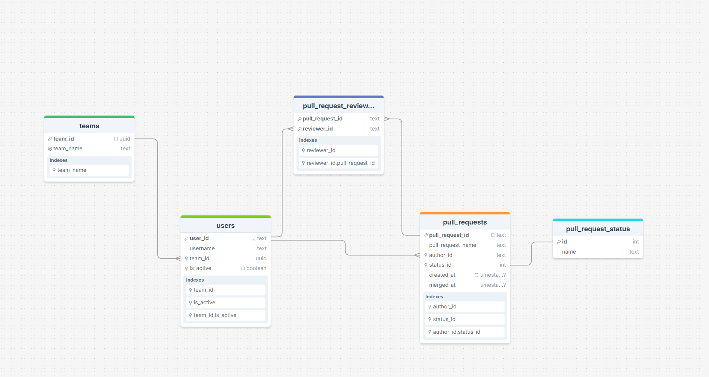

### Требования

- **Go** ≥ `1.24`
- Docker
- **Taskfile CLI** → [инструкция по установке](https://taskfile.dev/#/installation)

### Быстрый старт
```shell
Для запуска проекта нужно выполнить одну из команд
 1. `task up`
 2. `docker-compose up`.
После этого сервис будет доступен на порту `:8080` #(можно изменить в .env)
```

### Доп задания

#### Ре

#### Реализован дополнительный эндпоинт `/users/stats`
Возвращает статистику по пользователям: сколько PR создано каждым пользователем. 
Поддерживаются фильтры: 
  - `top`: вернуть только топ-N пользователей 
  - `only_active`: учитывать только активных пользователей
  - `only_open`: учитывать только PR в статусе OPEN

#### Добавлен health-чек при старте приложения через docker-compose по эндпоинту `/health`
####
В эндпоинт `/users/getReview` реализован и добавлен в openapi документацию ответ:
```
CODE = 404
{
  "error": {
    "code": "NOT_FOUND",
    "message": "user {user_id} not found"
  }
}
```


### Обособенности реализации

#### Подключены golangci-lint линтер и форматтеры gci и gofumpt

- Их настройки подробно описал в конце Readme.md

#### Генерация OpenAPI: ogen

  - Используется ogen для генерации HTTP-хендлеров, моделей и валидации.
  - Генерируемый код строго типизирован, исключает расхождения между контрактом и реализацией.
  - Генерация вынесена в отдельный Task (task api:gen).

#### Taskfile

Файл с готовыми командами для генерации кода, моков, форматирования, линтинга, поднятия окружения, прогона тестов и других задач.
Полный список команд
```shell
task
```

#### Работа с конфигурацией через env-интерфейсы

  - Конфигурация маппится в go структуры через библиотеку `caarlos0/env`
  - Описана через интерфейсы и структуру-обёртку.
  - Удобно мокать на тестах, не привязываясь к конкретным переменным окружения.
  - Инициализация выполняется на старте через метод `Load()`.

#### Написана собственная обёртка над zap
  - Единый формат логов; 
  - Автоматическое обогащение логов (trace_id, user_id) из context.Context, для возможности собирать трейсы в будущем
  - Уровень логирования задается через .env
  - Единый формат вывода (JSON / Console), не нужно настраивать в новых сервисах.
  - Безопасная работа в тестах (NoopLogger, InitForBenchmark).

#### Graceful shutdown 
  - В проекте используется небольшая утилита для аккуратного завершения сервиса. Она решает несколько задач:
  
    - Централизованное управление остановкой сервиса (CloseAll). 
    - Позволяет регистрировать функции закрытия (БД, HTTP-сервер). 
    - Реагирует на системные сигналы (SIGINT, SIGTERM) и запускает shutdown.
    - Закрывает ресурсы в обратном порядке, что удобно, когда одни зависят от других.
    - Выполнение shutdown-функций **параллельно в горутинах** + **корректная синхронизация (Mutex, WaitGroup)**.
    - Безопасная **работа с каналами** и ошибками — **нет гонок и утечек**.
    - Защищён от повторных вызовов и ошибок: есть sync.Once, обработка panic и таймаут.
    - Показывает в логах, что именно закрывается и сколько времени это заняло.
    

#### Миграции через goose
  - Написана небольшая обертка над goose  

  - Схема БД проходит миграции через goose.
  - Миграции лежать в папке: migrations/.
  - При старте приложения стартует
  - Гарантируется повторяемость структуры БД в любом окружении.

#### Чистая архитектура
- Каждый слой имеет свои модели, интерфейсы и полностью изолирован от остальных

Разделение на слои:
- App - точка входа в приложение
  - Проброс конфигов
  - Автоматически инициализация зависимостей через **Dependency Injection** контейнер
- Api - HTTP хендлеры 
  - Принимает бизнес структуры сервисного слоя, обрабатывает их
  - Отдает сгенерированные ogen объекты
- Service - бизнес-логика, оперирует чисто сервисными моделями
- Repository - работает с хранилищами (PostgreSQL)
  - Имеет собственные модели, адаптированные под конкретные хранилища
  - Всю конвертацию делает внутри - интерфейс оперирует бизнес моделями сервисного слоя

Cтруктура проекта

```
├── api
│   ├── pkg - сгенерированный ogen код
│   └── reviewer - openApi
├── cmd - точка входа в сервис
├── internal
│   ├── api - HTTP хендлеры
│   ├── app - точка входа в приложение и dependency injection
│   ├── config - обертка над .env конфигами
│   ├── converter - консвертер service <=> api
│   ├── model - сущности сервисного слоя
│   ├── repository
│   ├── server - структура сервера
│   └── service - бизнес-логика
├── migrations - миграции
└── pkg
    ├── closer - утилита для graceful shutdown
    ├── logger - обертка над uber/zap
    └── migrator - обертка над goose
```

#### Unit-тесты бизнес логики, используя mockery

Unit-тесты покрывают бизнес-логику **без внешних зависимостей**.

Все внешние вызовы — **через интерфейсы и моки** (автоматическая генерация моков с помощью Mockery).

По всех unit тестах используются табличные тесты через **Test Suite** из `testify/suite`:

#### Docker Compose

Полностью автоматизирует поднятие инфраструктуры

- Использует плейсхолдеры для подстановки переменных окружения из .env
- Создает volumes для серсисов которые должны хранить состояние.
- Делает healthcheck, с политикой ретраев и автоматически перезапускает контейнер при сбоях

#### Работа с БД

##### Структура БД



- Продумал структуру таблиц так, чтобы они строго отражали доменную модель.
- Нормализовал данные и исключил дублирование.
- Добавил нужные индексы под реальные запросы.
- Учитывал сценарии обновлений: UPDATE/SELECT внутри транзакций под Serializable.

### Проблемы, с которыми столкнулся

##### 1.
- Проблема:
  - В openApi документации в `required` указано значение `old_user_id`, а в примере `old_reviewer_id`, поэтому при генерации ogen валидирует поле как `old_user_id`.
  - Я выбрал изменить значение `required`, чтобы не сломать возможные внешние зависимости

Было
```yaml
/pullRequest/reassign:
  ...
required: [ pull_request_id, old_user_id ]
properties:
  old_user_id: { type: string }
  example:
    old_reviewer_id: u2
```

Стало
```yaml
/pullRequest/reassign:
  ...
required: [ pull_request_id, old_reviewer_id ]
properties:
  old_reviewer_id: { type: string }
  example:
    old_reviewer_id: u2
```

##### 2.
- Проблема:
  - При обращении к эндпойнту (например, /health) через localhost:8080 Postman выдавал “socket hang up”. Контейнер запускался успешно, порты были проброшены, но сервис извне оставался недоступным.
- Решение:
  - Обеспечить корректный доступ к HTTP‑серверу из хоста через проброшенные порты Docker.
- Действия:
  - Выяснил, что в коде сервер слушал адрес localhost:8080. В Docker‑контейнере это означает, что сервер слушает только локальные соединения внутри контейнера, а обращения снаружи (по проброшенному порту) не принимаются.
  - Изменил привязку на 0.0.0.0:8080, чтобы сервер слушал все интерфейсы контейнера.
- Результат:
  - После изменения сервис стал корректно доступен по localhost:8080 на хосте, и проблема с Postman была полностью решена. 

##### 3.
- Проблема:
  - Автогенерированный OpenAPI-интерфейс требует одной структуры-обработчика для всех эндпоинтов, что приводит к громоздкому и неудобному для поддержки коду.
- Решение:
  - Разделить бизнес-логику по доменным областям, сохранив совместимость с единым OpenAPI-интерфейсом.
- Действия:
  - Вынес доменные обработчики (PullRequest, Team, User) в отдельные пакеты с чистой бизнес-логикой. 
  - Реализовал агрегирующий Api, который делегирует вызовы соответствующим domain handler’ам и удовлетворяет OpenAPI-интерфейсу.
- Результат:
  - Архитектура стала чистой, легко масштабируемой и поддерживаемой, а сервис полностью совместим с автогенерируемым OpenAPI-сервером.

##### 4.
- Задача:
    - Нужно автоматически назначать до двух случайных ревьюверов из команды автора без повторов и с равномерным распределением. 
    - Выбрать алгоритм, который эффективно работает на больших командах выбирает `n` уникальных случайных элементов из массива, не перемешивая весь массив и не создавая лишних структур данных.

- Решение: 
  - Я использовал алгоритм Фишера–Йетса, потому что:
    - В отличие от `rand.Shuffle` он не перемешивает весь массив, а делает ровно `n` замен;
    - В отличие от подходов с `map` он не требует дополнительной памяти;

- Результат:
  Назначение ревьюверов стало равномерным и выполняется за `O(1)` даже на больших командах.

##### 5.
 - Проблема: при сборке Docker образа, внезапно начала вылезать ошибка (хотя до этого все работало отлично)
```shell
------
 > [builder 4/6] RUN go mod download:
1.053 go: github.com/caarlos0/env/v11@v11.3.1: Get "https://proxy.golang.org/github.com/caarlos0/env/v11/@v/v11.3.1.mod": unexpected EOF
------
```
- Решение:
  - Нашёл на StackOverflow тред по похожей проблеме: [Docker pull “unexpected EOF”](https://stackoverflow.com/questions/53677592/docker-pull-unexpected-eof)
    — там обсуждалось, что одной из причин может быть слабое или прерывающееся интернет-соединение.
  - Оказалось, что сервис по шифрованию трафика прерывал загрузку модулей. 

- Результат
  - После отключения сервиса по шифрованию трафика, сборка прошла успешно.
  - Альтернативный обход: указать `ENV GOPROXY=direct`
### CI/CD

Проект использует GitHub Actions. Основные workflow:

- **CI** (`.github/workflows/ci.yml`) - проверяет код при каждом push и pull request
    - Запуск линтера golangci-lint
    - Запуск unit тестов

### Конфигурация линтера (golangci-lint)

**Линтер автоматически запускается через Taskfile и в CI (GitHub Actions).**

##### Общие настройки

| Параметр                | Значение   | Назначение                                                                   |
|-------------------------|------------|------------------------------------------------------------------------------|
| `timeout`               | `5m`       | Максимальное время работы линтеров.                                          |
| `relative-path-mode`    | `gomod`    | Путь к файлам выводится относительно корня go-модуля.                        |
| `issues-exit-code`      | `1`        | При наличии ошибок процесс завершается кодом `1` (удобно для CI).            |
| `tests`                 | `true`     | Анализируются также файлы `*_test.go`.                                       |
| `modules-download-mode` | `readonly` | Запрещена загрузка зависимостей во время анализа (быстрее и надёжнее на CI). |

##### Формат вывода

Вывод линтера цветной и показывает строку, где найдена проблема.

| Параметр             | Значение | Назначение                                         |
|----------------------|----------|----------------------------------------------------|
| `print-linter-name`  | `true`   | Показывать имя линтера                             |
| `print-issued-lines` | `true`   | Показывать строку кода, где найдена проблема       |
| `colors`             | `true`   | Использовать цветной вывод (для лучшей читаемости) |

##### Правила обработки ошибок

| Параметр                | Значение | Назначение                                                                                    |
|-------------------------|----------|-----------------------------------------------------------------------------------------------|
| `max-issues-per-linter` | `0`      | Без лимита на количество ошибок от одного линтера.                                            |
| `max-same-issues`       | `0`      | Без лимита на количество одинаковых ошибок.                                                   |
| `uniq-by-line`          | `true`   | Отображать максимум одну ошибку на строку (избегает спама от разных линтеров по одной строке) |

##### Включённые линтеры

| Линтер         | Назначение                                                                  |
|----------------|-----------------------------------------------------------------------------|
| `errcheck`     | Проверяет, что ошибки не игнорируются.                                      |
| `staticcheck`  | Расширенный статический анализ (включает `gosimple`, `stylecheck`).         |
| `govet`        | Встроенный в Go инструмент анализа (ловит потенциальные баги).              |
| `gocritic`     | Набор продвинутых правил для улучшения качества кода.                       |
| `revive`       | Проверяет стиль кода, оформление, названия.                                 |
| `unused`       | Находит неиспользуемые переменные, типы, функции.                           |
| `gosec`        | Проверка на уязвимости и небезопасные практики.                             |
| `depguard`     | Запрещает импорт указанных пакетов (контроль зависимостей).                 |
| `bodyclose`    | Проверяет, что закрывается `resp.Body` у HTTP-запросов.                     |
| `asciicheck`   | Предупреждает о не-ASCII символах в коде.                                   |
| `cyclop`       | Контролирует цикломатическую сложность функций.                             |
| `dupl`         | Находит дублированные фрагменты кода.                                       |
| `ineffassign`  | Обнаруживает неиспользуемые присваивания.                                   |
| `unparam`      | Находит неиспользуемые параметры функций.                                   |
| `errorlint`    | Рекомендует использовать `errors.Is` / `errors.As` вместо прямых сравнений. |
| `errname`      | Проверяет имена переменных/типов ошибок (должны содержать "Err").           |
| `forbidigo`    | Запрещает определённые вызовы или конструкции по regex-паттернам.           |
| `contextcheck` | Проверяет, что `context.Context` передаётся в методы/функции.               |
| `containedctx` | Предупреждает, если `context.Context` сохраняется в структуре.              |

##### Отключённые линтеры

| Линтер    | Назначение                                    |
|-----------|-----------------------------------------------|
| `gocyclo` | Старый линтер сложности (заменён на cyclop).  |
| `lll`     | Проверка длины строк (часто шумная и мешает). |

##### Исключения из анализа

``` yaml
exclusions:
  generated: strict  # Игнорируются файлы с префиксом "// Code generated ... DO NOT EDIT."
  rules:
    - path: _test\.go # Для всех тестов:
      linters:
          - cyclop     # Не проверять сложность тестов
          - dupl       # Не проверять дублирование в тестах
          - gosec      # Не искать уязвимости в тестах
```

##### Индивидуальные настройки для конкретных линтеров

| Линтер      | Ключевые параметры и назначение                                                                                                                                                                                                                                                                                                                                                                                                                                                                                         |
|-------------|-------------------------------------------------------------------------------------------------------------------------------------------------------------------------------------------------------------------------------------------------------------------------------------------------------------------------------------------------------------------------------------------------------------------------------------------------------------------------------------------------------------------------|
| `gosec`     | `audit: true` &mdash; активировать все правила безопасности; <br/>`show-ignored: true` &mdash; показывать проигнорированные проблемы в комментариях; <br/> `severity: medium`, `confidence: medium` &mdash; отсекаем низкоприоритетные/неуверенные срабатывания.                                                                                                                                                                                                                                                        |
| `cyclop`    | `max-complexity: 20` &mdash; допустимая цикломатическая сложность функции повышена до 20 (чуть строже, чем при полном отсутствии лимита, но мягче, чем значение 10 по умолчанию).                                                                                                                                                                                                                                                                                                                                       |
| `depguard`  | `deny: io/ioutil` &mdash; запрещён устаревший пакет **`io/ioutil`** (рекомендуется использовать аналоги из `os`/`io`); параметр `desc` выводит поясняющее сообщение при нарушении.                                                                                                                                                                                                                                                                                                                                      |
| `revive`    | `severity: warning` &mdash; все замечания `revive` трактуются как предупреждения, а не блокирующие ошибки, позволяя постепенно приводить стиль кода к стандарту.                                                                                                                                                                                                                                                                                                                                                        |
| `forbidigo` | `exclude-godoc-examples: true` &mdash; не применять запреты к Godoc-примерам; <br/>`analyze-types: true` &mdash; искать запреты и в типах/константах, а не только в функциях; <br/> `forbid:` &mdash; список запрещённых паттернов; <br> - `fmt.Print*` &mdash; запрет прямого вывода, требуем структурированный логгер; <br> - `time.Sleep` &mdash; нельзя в продакшене, нужно использовать таймеры/контекст; <br> - `http.DefaultClient` &mdash; небезопасен без таймаутов, нужно создать собственный `*http.Client`. |

##### Форматеры

| Параметр                              | Значение                           | Назначение                                                                                                                                                                      |
|---------------------------------------|------------------------------------|---------------------------------------------------------------------------------------------------------------------------------------------------------------------------------|
| **`enable`**                          | `gofumpt`, `gci`                   | Автоматические форматтеры кода. <br/> `gofumpt` &mdash; cтрогая версия gofmt с дополнительными правилами <br/> `gci` &mdash; форматтер импортов (гибкая альтернатива goimports) |
| **`settings.gofumpt.extra-rules`**    | `true`                             | Более строгие правила (например, удаление лишних пустых строк).                                                                                                                 |
| **`settings.gci.sections`**           | `Standard`, `Default`, `Prefix(…)` | Группировка импортов: <br/> 1.Стандартная библиотека <br/> 2.Сторонние зависимости <br/> 3.Локальные импорты проекта.                                                           |
| **`settings.gci.no-inline-comments`** | `false`                            | Разрешить комментарии после импортов (true — запретит).                                                                                                                         |

